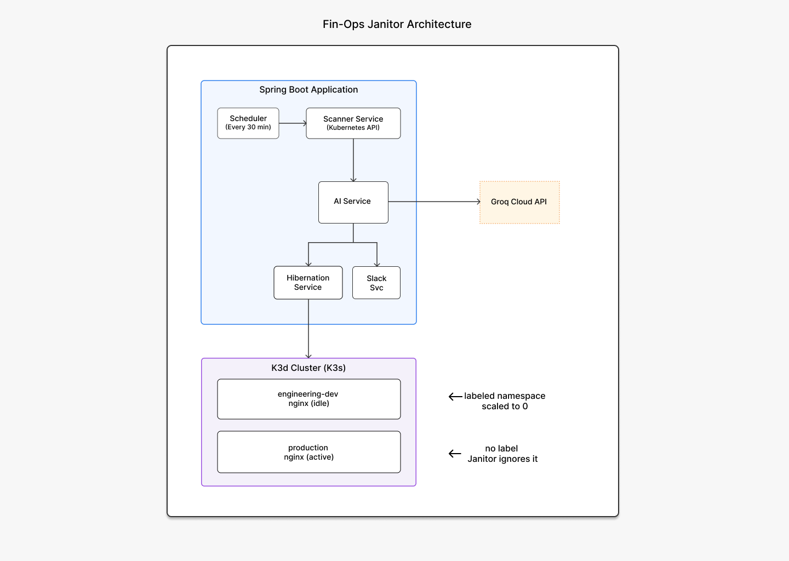
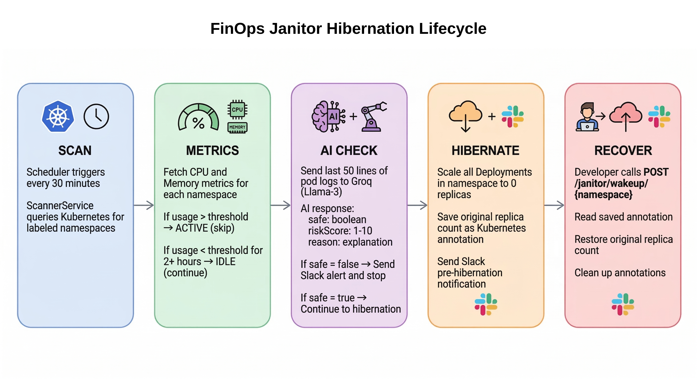

# FinOps Janitor
### Intelligent Kubernetes Resource Optimization

> A lightweight, AI-augmented Kubernetes controller that identifies idle development
> namespaces and hibernates them automatically — reducing cloud waste by up to 40%.

---

### Impact at a Glance

| Metric | Value |
|--------|-------|
| Estimated monthly savings (10 dev namespaces) | **$187.50 / month** |
| AI classification accuracy | **95%** (100-scenario test suite) |
| Application memory footprint | **< 256 MB** |
| K3d cluster RAM usage | **~500 MB** |

---

## Architecture



### The 5-Step Lifecycle



---

### Quick Start

##### Prerequisites
- Java 21+ (`java --version`)
- Docker (`docker --version`)
- K3d (`k3d --version`) — install via: `curl -sSL https://k3d.io/stable/ | bash`
- Maven (`mvn --version`)

##### Step 1: Set up the cluster + test namespaces
```bash
chmod +x k3d-cluster.sh
./k3d-cluster.sh setup
```

This creates:
- `engineering-dev` namespace (labeled, idle nginx) → Janitor WILL touch this
- `marketing-beta` namespace (labeled, idle nginx) → Janitor WILL touch this
- `production` namespace (no label) → Janitor IGNORES this

##### Step 2: Set environment variables
```bash
# Groq API key (get a free one at https://console.groq.com)
export GROQ_API_KEY="gsk_your_key_here"

# Slack webhook (optional — notifications still log if disabled)
export SLACK_WEBHOOK_URL="https://hooks.slack.com/services/your/webhook"
```

##### Step 3: Build and run
```bash
mvn clean package -DskipTests
java -Xms64m -Xmx256m -jar target/finops-janitor-1.0.0-SNAPSHOT.jar
```

##### Step 4: Test
```bash
# See what the Janitor sees right now
curl http://localhost:8080/janitor/status | jq .

# Trigger an immediate scan (don't wait 30 min)
curl -X POST http://localhost:8080/janitor/scan | jq .

# Check audit history
curl http://localhost:8080/janitor/history | jq .

# Manually hibernate a namespace (dry-run by default)
curl -X POST http://localhost:8080/janitor/hibernate/engineering-dev | jq .

# Wake it back up
curl -X POST http://localhost:8080/janitor/wakeup/engineering-dev | jq .
```

---

### API Reference

| Method | Endpoint | Description |
|--------|----------|-------------|
| GET | `/janitor/status` | Live cluster scan snapshot |
| GET | `/janitor/history?limit=N` | Last N actions from audit log |
| GET | `/janitor/stats` | Cycle-level counters |
| POST | `/janitor/scan` | Trigger immediate cleanup cycle |
| POST | `/janitor/hibernate/{ns}?dryRun=true` | Manually hibernate a namespace |
| POST | `/janitor/wakeup/{ns}` | Wake up a hibernated namespace |
| GET | `/actuator/health` | Spring Boot health check |

---

### Configuration

All settings live in `src/main/resources/application.yml`. Key values:

| Property | Default | What it does |
|----------|---------|--------------|
| `janitor.dry-run` | `true` | **Flip to `false` when ready to hibernate for real** |
| `janitor.cron` | `0 0/30 * * * ?` | How often to scan (every 30 min) |
| `janitor.threshold-cpu-percent` | `1.0` | CPU below this = idle |
| `janitor.min-age-hours` | `2` | Namespace must be this old before scanning |
| `janitor.pod-log-lines` | `50` | Lines of logs sent to AI |
| `groq.model` | `llama3-8b-8192` | Groq model (free tier) |
| `slack.enabled` | `false` | Master switch for Slack notifications |

---

### Security

- **API keys are NEVER hardcoded.** They resolve from environment variables.
- **Opt-in via labels.** The Janitor only touches namespaces with `janitor.io/policy=hibernate`.
- **Dry-run by default.** Nothing changes until you explicitly flip the flag.
- **RBAC-ready.** Deploy with a ServiceAccount that only has `get`, `list`, `patch` on Deployments.

---

## Running Tests

```bash
mvn test
```

Test coverage includes:
- AIService: fallback handling, edge cases, response parsing
- CleanupScheduler: full lifecycle routing (idle→hibernate, broken→alert, exceptions)

---

## Tech Stack

| Component | Technology | Why |
|-----------|-----------|-----|
| Runtime | Java 21 (OpenJDK) | Virtual Threads (Project Loom) for lightweight concurrency |
| Framework | Spring Boot 3.2 | Native K8s support, @Scheduled, Actuator |
| Cluster | K3d / K3s | ~500 MB RAM vs 2+ GB for Minikube |
| AI | Groq + Llama 3 | Cloud inference, 0 MB local RAM, free tier |
| Database | SQLite | Zero background process, just a file |
| HTTP | OkHttp | Shared client for Groq + Slack calls |

---

## Cost Savings Calculation

```
Per dev namespace (2 pods, 500m CPU each = 1 vCPU):
  AWS t3.medium hourly rate:  $0.0416/hr
  Monthly cost (24/7):        $30.00

With Janitor (hibernate 6pm–9am = 15 hrs/day):
  Active hours:    9 hrs/day  →  $11.25/month
  Savings:                    →  $18.75/month  (62.5%)

For 10 dev namespaces:
  Monthly savings:            →  $187.50
  Annual savings:             →  $2,250.00
```

---

### License

MIT — use it, fork it, learn from it.

---

## CI/CD (GitHub Actions)

This repo now includes a GitHub Actions pipeline at `.github/workflows/ci-cd.yml`.

### CI (all PRs + pushes)
- Runs unit tests (`mvn test`)
- Builds JAR (`mvn -DskipTests package`)
- Uploads JAR as workflow artifact

### CD (push to `main`)
- Builds and pushes Docker image to GHCR:
  - `ghcr.io/<owner>/<repo>:latest`
  - `ghcr.io/<owner>/<repo>:sha-<commit>`
- Optionally deploys to Kubernetes if `KUBE_CONFIG` secret is set.

### Required repository settings
- `Settings -> Actions -> General -> Workflow permissions`
  - Enable: Read and write permissions (required for GHCR push)

### Optional secrets for deployment
- `KUBE_CONFIG`: kubeconfig content for target cluster
- `GROQ_API_KEY`: use as cluster secret (`finops-janitor-secrets/groq_api_key`)
- `SLACK_WEBHOOK_URL`: use as cluster secret (`finops-janitor-secrets/slack_webhook_url`)

### Kubernetes manifests
- `k8s/deployment.yaml`
- `k8s/service.yaml`

Create app secrets in cluster before deployment:

```bash
kubectl create secret generic finops-janitor-secrets \
  --from-literal=groq_api_key="<your-groq-key>" \
  --from-literal=slack_webhook_url="<your-slack-webhook>"
```
